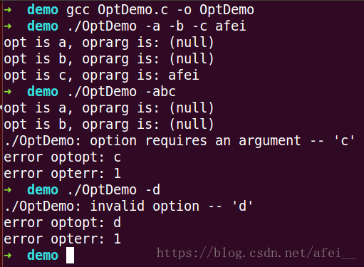

C/C++ 命令解析：getopt 方法详解和使用示例

## 一、简介

getopt() 方法是用来分析命令行参数的，该方法由 Unix 标准库提供，包含在 <unistd.h> 头文件中。


## 二、定义

```
int getopt(int argc, char * const argv[], const char *optstring);
 
extern char *optarg;
extern int optind, opterr, optopt;
```

getopt 参数说明：

-   argc：通常由 main 函数直接传入，表示参数的数量
-   argv：通常也由 main 函数直接传入，表示参数的字符串变量数组
-   optstring：一个包含正确的参数选项字符串，用于参数的解析。例如 “abc:”，其中 -a，-b 就表示两个普通选项，-c 表示一个必须有参数的选项，因为它后面有一个冒号

外部变量说明：

-   optarg：如果某个选项有参数，这包含当前选项的参数字符串
-   optind：argv 的当前索引值
-   opterr：正常运行状态下为 0。非零时表示存在无效选项或者缺少选项参数，并输出其错误信息
-   optopt：当发现无效选项字符时，即 getopt() 方法返回 ? 字符，optopt 中包含的就是发现的无效选项字符
    


## 三、实例分析

让我们通过一系列的实例来掌握 getopt 方法的使用吧。

### 1. 简单实例

OptDemo.c 如下：

```
#include <stdio.h>
#include <unistd.h>
 
int main(int argc, char *argv[]) {
    int o;
    const char *optstring = "abc:"; // 有三个选项-abc，其中c选项后有冒号，所以后面必须有参数
    while ((o = getopt(argc, argv, optstring)) != -1) {
        switch (o) {
            case 'a':
                printf("opt is a, oprarg is: %s\n", optarg);
                break;
            case 'b':
                printf("opt is b, oprarg is: %s\n", optarg);
                break;
            case 'c':
                printf("opt is c, oprarg is: %s\n", optarg);
                break;
            case '?':
                printf("error optopt: %c\n", optopt);
                printf("error opterr: %d\n", opterr);
                break;
        }
    }
    return 0;
}
```

编译和运行：



分析：

命令 gcc OptDemo.c -o OptDemo 是使用 gcc 把 OptDemo.c 编译成可执行程序，命名为 OptDemo

第一次运行 ./OptDemo -a -b -c afei 正常执行和输出

第二次运行 ./OptDemo -abc 由于选项 c 后没有输入参数，于是报错

第三次运行 ./OptDemo -d 由于选项 d 不是我们在 optstring 中预定义的选项，于是报错


### 2. 可选参数

一个冒号表示选项后必须有参数，没有参数就会报错。如果有两个冒号的话，那么这个参数就是可选参数了，即可有可没有。

OptDemo.c 如下：

```
#include <stdio.h>
#include <unistd.h>
 
void usage() {
    printf("Usage:\n");
    printf("\tOptDemo [-a] [-b] [-c message]");
}
 
int main(int argc, char *argv[]) {
    int o;
    const char *optstring = "abc::"; // 有三个选项-abc，其中c选项后有两个冒号，表示后面可选参数
    while ((o = getopt(argc, argv, optstring)) != -1) {
        switch (o) {
            case 'a':
                printf("opt is a, oprarg is: %s\n", optarg);
                break;
            case 'b':
                printf("opt is b, oprarg is: %s\n", optarg);
                break;
            case 'c':
                printf("opt is c, oprarg is: %s\n", optarg);
                break;
            case '?':
                printf("发生错误时提示用户正确的使用方式\n");
                usage(); // 提示使用说明
                break;
        }
    }
    return 0;
}
```

编译和运行：


冒号隔开：

```
#include <unistd.h>
#include <stdlib.h>
#include <stdio.h>
 
int main(int argc, char *argv[])
{
    int opt;
    char *optstring = "a:b:c:d";
 
    while ((opt = getopt(argc, argv, optstring)) != -1)
    {
        printf("opt = %c\n", opt);
        printf("optarg = %s\n", optarg);
        printf("optind = %d\n", optind);
        printf("argv[optind - 1] = %s\n\n",  argv[optind - 1]);
    }
 
    return 0;
}
```

编译上述程序并运行，有如下结果：

```
cashey@ubuntu:~/Desktop/getopt$ ./test_getopt -a 100 -b 200 -c admin -d
opt = a
optarg = 100
optind = 3
argv[optind - 1] = 100
 
opt = b
optarg = 200
optind = 5
argv[optind - 1] = 200
 
opt = c
optarg = admin
optind = 7
argv[optind - 1] = admin
 
opt = d
optarg = (null)
optind = 8
argv[optind - 1] = -d
```

